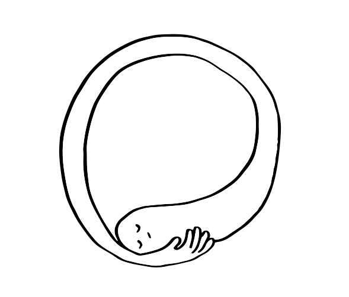
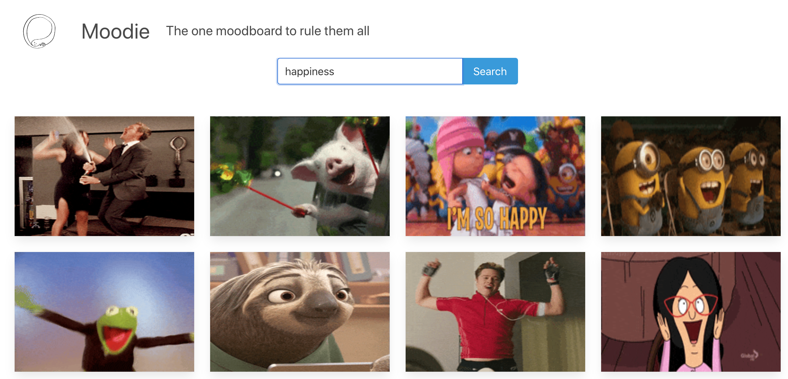

  

# Building a moodboard with Bulma & pure HTML ([live demo](https://html-moodie.netlify.com))

 

## Setup

1. Obtain a Giphy API key by following [the instructions](https://support.giphy.com/hc/en-us/articles/360020283431-Request-A-GIPHY-API-Key).
2. Rename `secrets.example.json` to `secrets.json` and paste the key.
3. Run `npm install` and `npm start`.
4. Tweak the code and enjoy!

- [`index.html`](./index.html) contains the driver markup for the app.
- [`js/giphy.js`](./js/giphy.js) defines helpers and utilities for fetching from the Giphy API